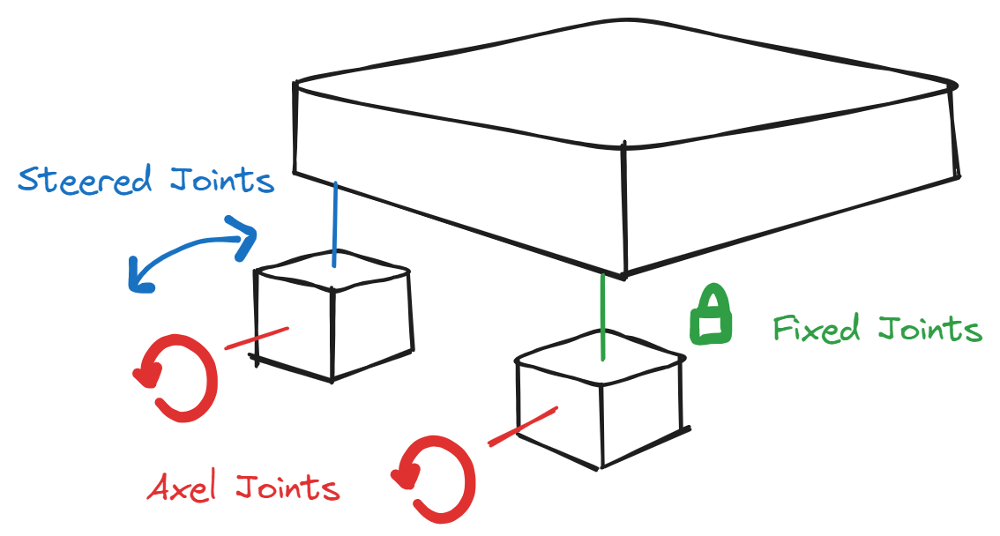

# Wheels

## wheel components

### Rapier constants
```tsx
const RAPIER_UPDATE_PRIORITY = -50
const AFTER_RAPIER_UPDATE = RAPIER_UPDATE_PRIORITY - 1
const AXLE_TO_CHASSIS_JOINT_STIFFNESS = 150000
const AXLE_TO_CHASSIS_JOINT_DAMPING = 20
const DRIVEN_WHEEL_FORCE = 600
const DRIVEN_WHEEL_DAMPING = 5
```
<hr/>



### Fixed Joints

```tsx
type FixedJointProps = {
  body: RefObject<RapierRigidBody>
  wheel: RefObject<RapierRigidBody>
  body1Anchor: Vector3Tuple
  body1LocalFrame: Vector4Tuple
  body2Anchor: Vector3Tuple
  body2LocalFrame: Vector4Tuple
}

const FixedJoint = ({ body, wheel, body1Anchor, body1LocalFrame, body2Anchor, body2LocalFrame }: FixedJointProps) => {
  useFixedJoint(body, wheel, [body1Anchor, body1LocalFrame, body2Anchor, body2LocalFrame])

  return null
}
```

### Axel Joints

```tsx
type AxleJointProps = {
  body: RefObject<RapierRigidBody>
  wheel: RefObject<RapierRigidBody>
  bodyAnchor: Vector3Tuple
  wheelAnchor: Vector3Tuple
  rotationAxis: Vector3Tuple
  isDriven: boolean
}

const AxleJoint = ({ body, wheel, bodyAnchor, wheelAnchor, rotationAxis, isDriven }: AxleJointProps) => {
  const joint = useRevoluteJoint(body, wheel, [bodyAnchor, wheelAnchor, rotationAxis])

  const forwardPressed = useKeyboardControls((state) => state.forward)
  const backwardPressed = useKeyboardControls((state) => state.back)
  const brakePressed = useKeyboardControls((state) => state.brake)

  useEffect(() => {
    if (!isDriven) return

    let forward = 0
    if (brakePressed) {
      forward = 0
      joint.current?.configureMotorVelocity(0, 0)
      return
    }
    if (forwardPressed) forward += 1
    if (backwardPressed) forward -= 1
    

    forward *= DRIVEN_WHEEL_FORCE

    if (forward !== 0) {
      wheel.current?.wakeUp()
    }

    joint.current?.configureMotorVelocity(forward, DRIVEN_WHEEL_DAMPING)
  }, [forwardPressed, backwardPressed, brakePressed])

  return null
}
```

### Steered Joints

```tsx
type SteeredJointProps = {
  body: RefObject<RapierRigidBody>
  wheel: RefObject<RapierRigidBody>
  bodyAnchor: Vector3Tuple
  wheelAnchor: Vector3Tuple
  rotationAxis: Vector3Tuple
}

const SteeredJoint = ({ body, wheel, bodyAnchor, wheelAnchor, rotationAxis }: SteeredJointProps) => {
  const joint = useRevoluteJoint(body, wheel, [bodyAnchor, wheelAnchor, rotationAxis])

  const left = useKeyboardControls((state) => state.left)
  const right = useKeyboardControls((state) => state.right)
  const targetPos = left ? 0.25 : right ? -0.25 : 0

  useEffect(() => {
    joint.current?.configureMotorPosition(targetPos, AXLE_TO_CHASSIS_JOINT_STIFFNESS, AXLE_TO_CHASSIS_JOINT_DAMPING)
  }, [left, right])

  return null
}
```

<hr/>

### Wheels

```tsx
type WheelInfo = {
  axlePosition: Vector3Tuple
  wheelPosition: Vector3Tuple
  isSteered: boolean
  side: 'left' | 'right'
  isDriven: boolean
}

  const wheels: WheelInfo[] = [
    {
      axlePosition: [-1.2, -0.6, 0.7],
      wheelPosition: [-1.2, -0.4, 1],
      isSteered: true,
      side: 'left',
      isDriven: false,
    },
    {
      axlePosition: [-1.2, -0.6, -0.7],
      wheelPosition: [-1.2, -0.4, -1],
      isSteered: true,
      side: 'right',
      isDriven: false,
    },
    {
      axlePosition: [1.2, -0.6, 0.7],
      wheelPosition: [1.2, -0.4, 1],
      isSteered: false,
      side: 'left',
      isDriven: true,
    },
    {
      axlePosition: [1.2, -0.6, -0.7],
      wheelPosition: [1.2, -0.4, -1],
      isSteered: false,
      side: 'right',
      isDriven: true,
    },
  ]
```
### Refs
```tsx
const wheelRefs = useRef<RefObject<RapierRigidBody>[]>(wheels.map(() => createRef()))
const axleRefs = useRef<RefObject<RapierRigidBody>[]>(wheels.map(() => createRef()))
```

### JSX wheels
```tsx
{wheels.map((wheel, i) => (
    <React.Fragment key={i}>
        {/* axle */}
        <RigidBody ref={axleRefs.current[i]} position={wheel.axlePosition} colliders="cuboid">
        <mesh rotation={[Math.PI / 2, 0, 0]} castShadow receiveShadow>
            <boxGeometry args={[0.3, 0.3, 0.3]} />
            <meshStandardMaterial color="white" opacity={0.001} transparent />
        </mesh>
        </RigidBody>

        {/* wheel */}
        <RigidBody ref={wheelRefs.current[i]} position={wheel.wheelPosition} colliders={false}>
        <mesh rotation-x={-Math.PI / 2} castShadow receiveShadow>
            <cylinderGeometry args={[0.25, 0.25, 0.24, 32]} />
            <meshStandardMaterial color="#666" />
        </mesh>

        <mesh rotation-x={-Math.PI / 2}>
            <cylinderGeometry args={[0.251, 0.251, 0.241, 16]} />
            <meshStandardMaterial color="#000" wireframe />
        </mesh>

        <CylinderCollider mass={0.5} friction={5} args={[0.125, 0.25]} rotation={[-Math.PI / 2, 0, 0]} />
        </RigidBody>

        {/* axle to chassis joint */}
        {!wheel.isSteered ? (
        <FixedJoint
            body={chassisRef}
            wheel={axleRefs.current[i]}
            body1Anchor={wheel.axlePosition}
            body1LocalFrame={[0, 0, 0, 1]}
            body2Anchor={[0, 0, 0]}
            body2LocalFrame={[0, 0, 0, 1]}
        />
        ) : (
        <SteeredJoint
            body={chassisRef}
            wheel={axleRefs.current[i]}
            bodyAnchor={wheel.axlePosition}
            wheelAnchor={[0, 0, 0]}
            rotationAxis={[0, 1, 0]}
        />
        )}

        {/* wheel to axle joint */}
        <AxleJoint
        body={axleRefs.current[i]}
        wheel={wheelRefs.current[i]}
        bodyAnchor={[0, 0, wheel.side === 'left' ? 0.35 : -0.35]}
        wheelAnchor={[0, 0, 0]}
        rotationAxis={[0, 0, 1]}
        isDriven={wheel.isDriven}
        />

    </React.Fragment>
))}
```

### Model Wheels
```tsx
<mesh geometry={nodes.tireFL1.geometry} material={materials.blacktrim} position={[0.536, -0.193, -0.479]} rotation={[3.141, -0.006, -1.582]} scale={0.445} />
<mesh geometry={nodes.shadeWhite_006.geometry} material={nodes.shadeWhite_006.material} position={[0.536, -0.193, -0.479]} rotation={[3.141, -0.006, -1.582]} scale={0.445} />
<mesh geometry={nodes.axelBlockFL1.geometry} material={materials.blacktrim} position={[1.099, 0, -0.534]} />
<mesh geometry={nodes.tireFR2.geometry} material={materials.blacktrim} position={[0.535, -0.193, 0.474]} rotation={[0, 0, 1.559]} scale={0.445} />
<mesh geometry={nodes.shadeWhite_006001.geometry} material={nodes.shadeWhite_006001.material} position={[0.535, -0.193, 0.474]} rotation={[0, 0, 1.559]} scale={0.445} />
<mesh geometry={nodes.axelBlockFR2.geometry} material={materials['blacktrim.004']} position={[1.099, 0, 0.009]} />
<mesh geometry={nodes.tireRR3.geometry} material={materials.blacktrim} position={[-0.568, -0.193, 0.474]} rotation={[0, 0, 1.559]} scale={0.445} />
<mesh geometry={nodes.shadeWhite_006002.geometry} material={nodes.shadeWhite_006002.material} position={[-0.568, -0.193, 0.474]} rotation={[0, 0, 1.559]} scale={0.445} />
<mesh geometry={nodes.axelBlockRR3.geometry} material={materials['blacktrim.005']} position={[-0.004, 0, 0.009]} />
<mesh geometry={nodes.tireRl4.geometry} material={materials.blacktrim} position={[-0.567, -0.193, -0.479]} rotation={[3.141, -0.006, -1.582]} scale={0.445} />
<mesh geometry={nodes.shadeWhite_006003.geometry} material={nodes.shadeWhite_006003.material} position={[-0.567, -0.193, -0.479]} rotation={[3.141, -0.006, -1.582]} scale={0.445} />
<mesh geometry={nodes.axelBlockRL4.geometry} material={materials['blacktrim.006']} position={[-0.004, 0, -0.529]} />
```
